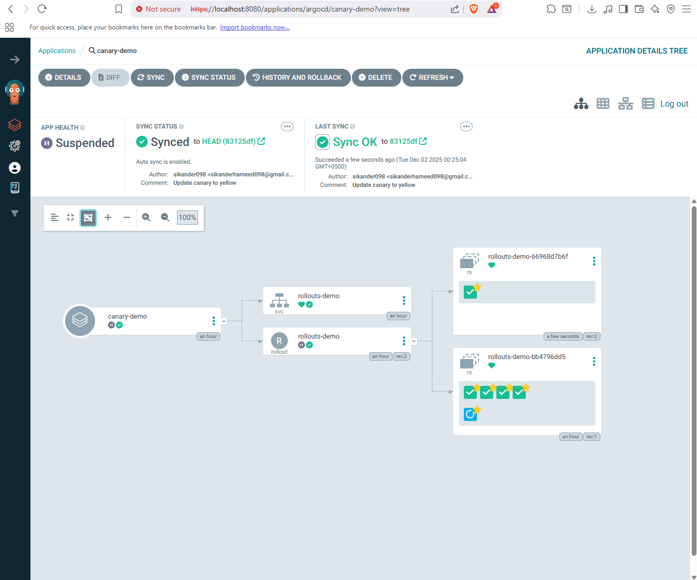
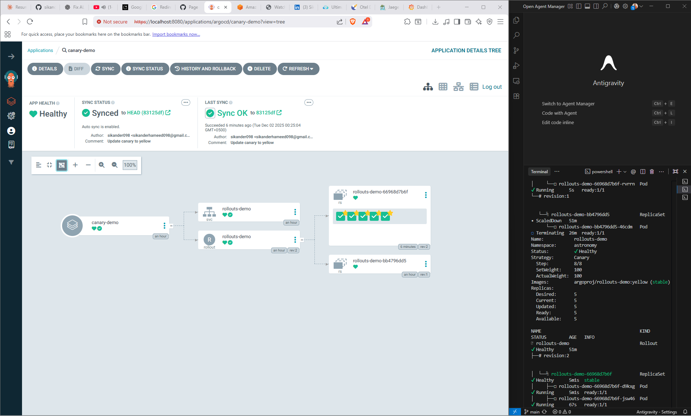
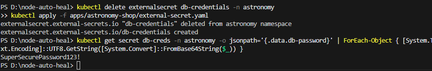

# Self-Healing, Cost-Optimized EKS Platform 🚀

  

## 📖 Overview
This project represents a **production-grade migration** from legacy Kubernetes scaling (Cluster Autoscaler) to a high-performance **Karpenter** architecture. 

The goal was to solve two critical problems in EKS:
1.  **Cost Inefficiency:** Standard scaling was using 100% On-Demand instances.
2.  **Slow Recovery:** Node provisioning took 3-5 minutes during traffic spikes.

## 🏗 Architecture
The platform utilizes a **Hybrid Node Strategy** to balance cost and reliability:

| Component | Strategy | Technology |
| :--- | :--- | :--- |
| **Microservices** | **Spot Instances** (80% Savings) | Karpenter NodePool (Default) |
| **Databases** | **On-Demand Instances** (Zero Data Loss) | Karpenter NodePool (Critical) |
| **Observability** | Full Traceability | OpenTelemetry + Jaeger |
| **Resilience** | Auto-Drain on Interruption | AWS Spot Termination Handler |

## 📸 Proof of Concepts

### 1. Hybrid Architecture (Spot vs. On-Demand)
Proven isolation of critical databases (Postgres/Redis) onto On-Demand nodes, while scaling stateless frontend apps onto Spot instances.

### 2. Automated Self-Healing
Captured logs showing Karpenter detecting an **AWS Spot Interruption Warning** and automatically cordoning/draining the node 2 minutes before termination.

### 3. Deep Observability (Distributed Tracing)
Integrated OpenTelemetry to trace requests from the Frontend Load Balancer down to the Redis Cache.

### 4. Advanced Deployment Strategies (Canary)
Progressive delivery using ArgoCD Rollouts to safely shift traffic to new versions.

### 5. ArgoCD Rollout Visualization
Real-time visualization of the canary rollout process in ArgoCD.

### 6. Secret Management (External Secrets Operator)
Securely syncing secrets from AWS Secrets Manager to Kubernetes Native Secrets.

## 🛠 Tech Stack
*   **Orchestration:** Amazon EKS v1.29
*   **Scaling Engine:** Karpenter v1.0
*   **Monitoring:** Kube-Prometheus-Stack (Grafana/Alertmanager)
*   **Tracing:** Jaeger & OpenTelemetry Operator
*   **Security:** IAM Roles for Service Accounts (IRSA)

## 🚀 How to Deploy
1. **Provision EKS:** Ensure OIDC is enabled.
2. **Install Karpenter:** Apply the NodePools located in the infra/ folder.
   `ash
   kubectl apply -f infra/karpenter-pool.yaml
   kubectl apply -f infra/karpenter-ondemand.yaml
   `
3. **Deploy Workload:** Install the OpenTelemetry Demo using the SRE overrides.
   `ash
   helm install otel-demo open-telemetry/opentelemetry-demo -n astronomy -f apps/sre-values.yaml
   `
4. **Patch Databases:** Run the patch script to move stateful workloads to On-Demand nodes.
   `ash
   ./apps/patch-databases.ps1
   `

